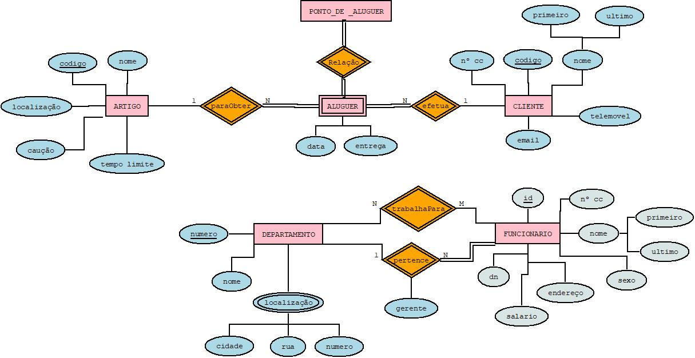

# C2 : Esquema conceptual

## Modelo E/A

### Entidades:

ARTIGO (_codigo, nome, localizaçao, cauçao, tempo limite) 
CLIENTE (

Diagrama E/A 

## Regras de negócio adicionais (Restrições)
Alguns dos artigos não tem qualquer caução ou limite de horas de aluguer.

O gerente deve fazer uma análise mensalmente relativamente aos alugueres efetuados no respetivo mês. 

---
[< Previous](rebd01.md) | [^ Main](https://github.com/tcm-sibd-g07/SIBD07/) | [Next >](rebd03.md)
:--- | :---: | ---: 
