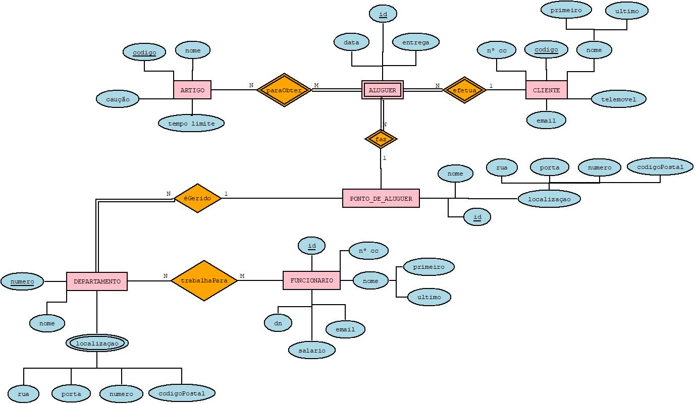

# C2 : Esquema conceptual

## Modelo E/A

### Entidades:

ARTIGO (<ins>codigo</ins>, nome, cauçao, tempo limite, quantidade)

CLIENTE (<ins>codigo</ins>, nCC, telemovel, email, nome (primeiro, ultimo))

DEPARTAMENTO (<ins>numero</ins>, nome, {localizaçao (codigoPostal, rua, porta, localidade)})

FUNCIONARIO (<ins>id</ins>, nCC, nome (primeiro, ultimo), email, salario, dn)

ALUGUER (<ins>id</ins>, data)

PONTO_DE_ALUGUER (nome, <ins>id</ins>, {localização (codigoPostal, rua, porta, localidade)})

### Associações:

trabalhaPara (FUNCIONARIO, DEPARTAMENTO) N:M  P/P

efetua (CLIENTE, ALUGUER) 1:N  P/P

paraObter (ALUGUER, ARTIGO) M:N  P/T

faz (PONTO_DE_ALUGUER, ALUGUER) 1:N  P/P

éGerido (PONTO_DE_ALUGUER, DEPARTAMENTO) 1:N  P/T

Diagrama E/A 

## Regras de negócio adicionais (Restrições)
Alguns dos artigos não tem qualquer caução ou limite de horas de aluguer.

O gerente deve fazer uma análise mensalmente relativamente aos alugueres efetuados no respetivo mês. 

---
[< Previous](rebd01.md) | [^ Main](https://github.com/tcm-sibd-g07/SIBD07/) | [Next >](rebd03.md)
:--- | :---: | ---: 
