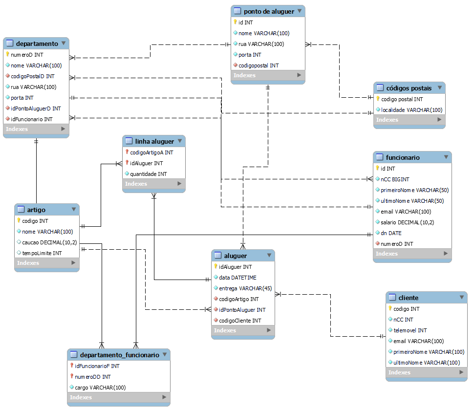

# C4 : Esquema Relacional  <!-- omit in toc -->

## Relações

### Tabela

##### Descrição das tabelas: 

| **Nome** | **Descrição** |
| --- | --- |
| **Departamento** | Informação sobre os departamentos. | 
| **Artigo** | Informaçoes sobre os artigos. | 
| **Aluguer** | Informações sobre os alugueres. |
| **Cliente** |Informações sobre os Clientes. | 
| **Funcionario** |Informações sobre os funcionários. | 
| **Códigos Postais** |Informações sobre os códigos postais. | 
| **Departamento Funcionário** |Informações sobre os funcionários que trabalham num departamento. | 
| **Linha Aluguer** |Informações sobre o Aluguer dos Artigos. | 
| **Ponto de Aluguer** |Informações sobre os Pontos de Aluguer. | 
  

## Vistas

---
| [< Previous](rebd03.md) | [^ Main](https://github.com/tcm-sibd-g07/SIBD07/) | [Next >](rebd05.md) |
| :---------------------- | :------------------------------------------------------: | ------------------: |
 
