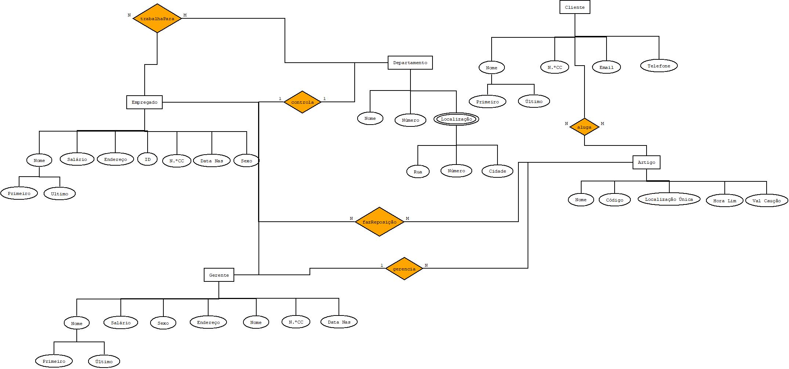

# C3 : Esquema conceptual

## Modelo E/A
**Entidades:**

DEPARTAMENTO (nome, numero, localização (cidade, rua, numero))

EMPREGADO (nome (primeiro e último), ID, número CC, endereço, salário, sexo, data de nascimento) 

GERENTE (nome (primeiro e último), número CC, endereço, sexo, data de nascimento)

ARTIGO (nome, código localização unica, hora lim, val caução)

CLIENTE (nome (primeiro e último), número CC, email e telefone)

------------------------------------------------

**Associações:**
trabalhaPara (EMPREGADO, DEPARTAMENTO) N:M

fazReposição (EMPREGADO, ARTIGO) N:M

gerencia (GERENTE, ARTIGO) 1:N

controla (GERENTE, DEPARTAMENTO) 1:1

aluga (CLIENTE, ARTIGO) N:M

Diagrama E/A 
   

Driagrama Entidade-Associação

## Regras de negócio adicionais (Restrições)
Alguns dos artigos não tem qualquer caução ou limite de horas de aluguer.

---
[< Previous](rei02.md) | [^ Main](https://github.com/tcm-sibd-g07/SIBD07/) | Next >
:--- | :---: | ---: 
